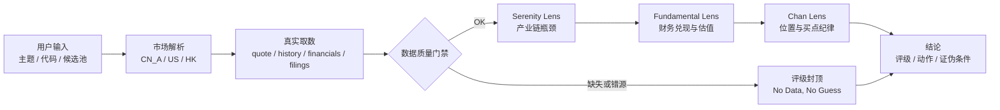
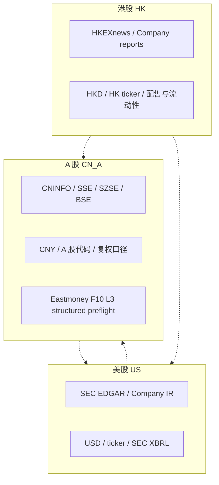
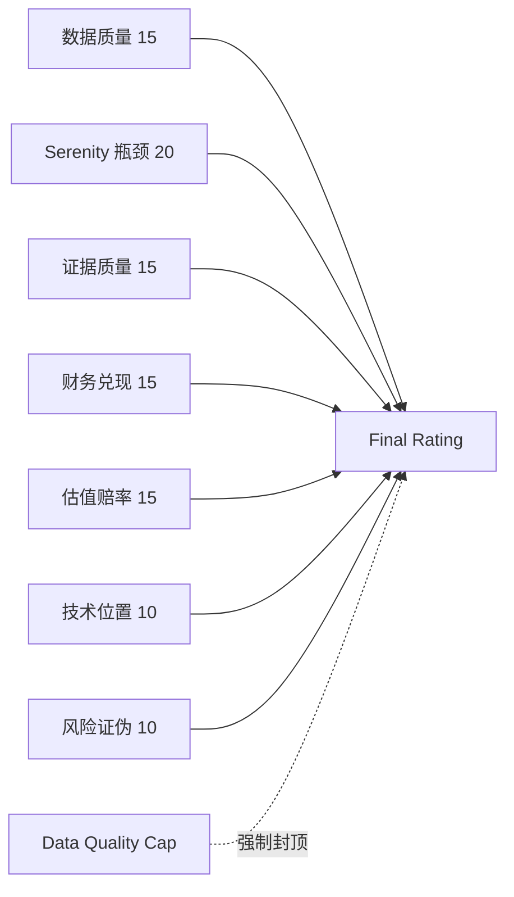
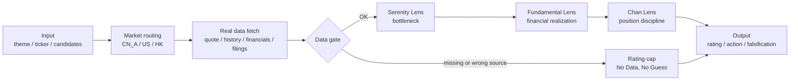

# serenity-chan-stock-skill

Language: [中文](#中文) | [English](#english)

`serenity-chan-stock-skill` turns a market theme, stock ticker, or candidate pool into a data-first equity research workflow with auditable evidence, falsification triggers, market-specific source routing, and rating caps.

Scope: research workflow, evidence discipline, rating constraints, and falsification tracking. The skill does not provide personalized investment advice, promise returns, or execute trades.

---

## 中文

### 一句话

把“这个题材/这只股票值不值得研究？”变成一份可核验、可证伪、可跟踪的研究结论。

```text
定位：先取数、验来源、找瓶颈、算兑现、看位置、给评级上限和证伪条件。
```

### 它解决什么问题

| 常见 AI 投研问题 | serenity-chan-stock-skill 的处理方式 |
|---|---|
| 看起来很完整，其实没有真实数据 | 强制 Data-First preflight，关键数据缺失必须降级 |
| A 股、美股、港股源混用 | 先解析市场，再走市场专属披露源和行情源 |
| 热点题材直接映射股票 | 先排产业链层级，再排公司，先找瓶颈再找标的 |
| 用技术买点证明公司好 | Chan Lens 只判断位置，不替代基本面证据 |
| 高增长叙事被无限外推 | H4/H5 增长必须由原始披露、订单、产能或财务兑现支持 |
| 输出无法复盘 | 必须给证据等级、缺失字段、评级上限和证伪触发器 |

### 核心原则

**No Data, No Guess.**

没有取到关键数据时，不允许编造当前价格、市值、财报、客户、订单、估值或买点。取不到就写清楚，评级上限必须下降。



### 什么时候使用

| 场景 | 你可以这样问 |
|---|---|
| 单股研究 | `分析 NVDA，先取真实数据，再判断长线胜率、估值和买点纪律。` |
| A 股主题扫描 | `分析国产算力链，先排产业链瓶颈，再筛 1-3 个长线候选。` |
| 跨市场比较 | `比较 NVDA、TSM、688019.SH，注意不要混用披露源和货币口径。` |
| 新闻转财报 | `这条 AI infrastructure news 会传导到哪些公司财报？给 1-4 季度验证路径。` |
| 数据核验 | `不要猜，先确认当前价、复权历史、财报和 filing 是否取到。` |

### 三个分析镜头

| 镜头 | 负责回答 | 不允许做什么 |
|---|---|---|
| Serenity Lens | 钱流向哪一层？真正卡点在哪里？谁控制瓶颈？ | 不能直接把热点词变成股票清单 |
| Fundamental + Valuation Lens | 收入、利润、现金流、估值和隐含增长能否兑现？ | 不能用概念热度提高内在增长假设 |
| Chan Lens | 好公司当前是否处于好位置？有没有结构化买点？ | 不能用技术形态拯救被证伪的基本面 |

### 市场路由

同强不同源：A 股、美股、港股经过同样严格的判断层级，但不能互相借用主披露源。

| 市场 | 代码例子 | 主披露源 | 内置/可用能力 | 不能做 |
|---|---|---|---|---|
| A 股 | `688019.SH` / `300750.SZ` | 巨潮、上交所、深交所、北交所 | Yahoo L2 行情/历史，CNINFO 公告元数据，Eastmoney F10 L3 结构化财务预检 | 用 SEC 替代巨潮/交易所公告；把 F10 当官方原文 |
| 美股 | `NVDA` / `MU` / `AMD` | SEC EDGAR、Company IR | Yahoo L2 行情/历史，SEC companyfacts/submissions | 用 A 股 F10 或摘要替代 SEC |
| 港股 | `0700.HK` / `9988.HK` | HKEXnews、公司公告 | Yahoo L2 行情/历史 | 混用 A/H、ADR 的价格、股本和货币 |



虚线表示 forbidden substitution：可以做跨市场比较，但不能把一个市场的披露源、价格、股本或货币口径直接替代另一个市场。

### 数据质量门禁

任何涉及当前股价、历史走势、估值、财报、订单、客户关系、公告、买点或评级的任务，都必须先做数据预检。

| 数据项 | 可用状态 | 失败后影响 |
|---|---|---|
| 市场与代码解析 | `OK / PARTIAL / FAILED` | 解析失败只能 `OBSERVE_ONLY` |
| 当前价格 | `OK / PARTIAL / STALE / FAILED / PENDING / NOT_REQUESTED` | 不能给当前买点，评级最高 B |
| 历史复权行情 | `OK / PARTIAL / STALE / FAILED / PENDING / NOT_REQUESTED` | 不能输出缠论买点，技术评级最高 C |
| 财报数据 | `OK / PARTIAL / STALE / FAILED / PENDING / NOT_APPLICABLE / NOT_REQUESTED` | 不能给 S/A 长线结论 |
| 公告/filing | `OK / PARTIAL / STALE / FAILED / PENDING / NOT_APPLICABLE / NOT_REQUESTED` | 客户、订单、产能只能算线索 |
| 供应链证据 | `OK / PARTIAL / STALE / FAILED / PENDING / NOT_REQUESTED` | 弱证据不能支撑高评级 |

`NOT_APPLICABLE` 和 `NOT_REQUESTED` 在正式评级任务中按关键数据不可用处理，必须触发评级封顶。

A 股财报来自 `Eastmoney_F10_Financials_L3` 时，财报状态可以记为 `OK`，证据等级仍按 L3 结构化预检处理；没有巨潮/交易所报告 PDF 或 L1 数据库复核时，最终研究评级最高到 `B`。

联网 fetch 会生成 `ai_review`：AI 必须基于 source level、warnings、validation warnings、行业报表口径和 raw source 判断是否能升级，而不能只把脚本状态当结论。

### 评级含义

| 评级 | 含义 | 使用边界 |
|---|---|---|
| S | 核心长线候选 | 数据、证据、财务、估值和位置都很强 |
| A | 强观察对象 | 结论强，但仍需等待验证或买点 |
| B | 有潜力但有缺口 | 数据、证据、估值或时点存在明显缺口 |
| C | 主题型或交易型 | 不适合作长线核心，只能跟踪线索 |
| D | 剔除或反面样本 | 已证伪、风险过大或质量不达标 |
| OBSERVE_ONLY | 仅观察 | 市场、代码或关键数据未解析 |

评分是 100 分制的候选决策强度评分，用于判断一个标的是核心候选、强观察、仅跟踪线索，还是应该剔除。它必须给出强弱和优先级，并同时受数据可用性、源强度、AI 证据裁决、估值赔率、技术位置和证伪条件约束。

如果出现 `l3_financials_without_l0_l1_verification`、`financial_sector_without_industry_specific_statements`、关键数据缺失、弱证据或 H4/H5 估值缺口，scorecard 必须触发 penalty cap。高模块分数不能覆盖这些 cap。



### 快速开始

解析代码和数据源计划：

```bash
python scripts/data_router.py resolve 688019
python scripts/data_router.py plan NVDA
```

真实取数并生成可审计数据包：

```bash
python scripts/data_router.py fetch NVDA \
  --out-dir /tmp/serenity-chan-data/NVDA-smoke \
  --sec-user-agent "Your Name your.email@example.com"
```

运行报告门禁：

```bash
python scripts/validate_output_contract.py <report.md>
python scripts/validate_output_contract_json.py <contract.json>
```

运行本地 eval：

```bash
python scripts/run_static_evals.py
python scripts/run_real_data_smoke.py --case-set all \
  --out-root /tmp/serenity-chan-real-data-smoke \
  --sec-user-agent "Your Name your.email@example.com"
```

### 内置工具

| 路径 | 作用 |
|---|---|
| `scripts/data_layer.py` | 市场解析、真实数据 adapter、源路由底层契约 |
| `scripts/data_router.py` | CLI 入口，生成 fetch plan、真实数据包和质量报告 |
| `scripts/market_source_policy.py` | Markdown/JSON 共享的市场错源检测规则 |
| `scripts/validate_output_contract.py` | Markdown 报告门禁 |
| `scripts/validate_output_contract_json.py` | 结构化 JSON 输出合同门禁 |
| `scripts/serenity_chan_scorecard.py` | 100 分评分与评级封顶 |
| `scripts/build_falsification_dashboard.py` | 证伪条件 dashboard 生成与校验 |
| `scripts/run_static_evals.py` | 静态回归用例 |
| `scripts/run_real_data_smoke.py` | 联网真实取数 smoke，覆盖 A 股行情/财务/公告 |

### 安装

Codex / Agent Skills-compatible clients:

```bash
SKILL_DIR="${CODEX_HOME:-$HOME/.codex}/skills/serenity-chan-stock-skill"
mkdir -p "$SKILL_DIR"
cp -R SKILL.md references assets scripts examples evals agents "$SKILL_DIR"/
```

Claude Code:

```bash
SKILL_DIR="$HOME/.claude/skills/serenity-chan-stock-skill"
mkdir -p "$SKILL_DIR"
cp -R SKILL.md references assets scripts examples evals agents "$SKILL_DIR"/
```

### 本地验证

```bash
python scripts/validate_skill.py .
python scripts/serenity_chan_scorecard.py assets/scorecard_template.json --validate-only
python scripts/build_falsification_dashboard.py examples/falsification_dashboard_example.json --validate-only
python scripts/validate_output_contract.py evals/fixtures/pass_no_network_buy_point.md
python scripts/validate_output_contract_json.py evals/fixtures/pass_output_contract_json.json
python scripts/run_static_evals.py
```

---

## English

### What It Is

`serenity-chan-stock-skill` is a data-first equity research skill for A-share, US, HK, and cross-market stock research.

It helps an AI agent convert a theme, ticker, or candidate pool into a verifiable research output with source routing, data-quality gates, evidence levels, rating caps, and falsification triggers.

It does not produce personalized investment advice, promise returns, or execute trades.

### Core Promise

**No Data, No Guess.**

If critical data is missing, the output must say so and downgrade the rating cap. The agent must not invent current prices, market caps, financials, customers, orders, valuations, or buy points.



### Why It Exists

| AI research failure mode | Guardrail |
|---|---|
| Polished output without real data | Mandatory data preflight |
| Mixed A-share, US, and HK sources | Market-specific disclosure routing |
| Hot theme directly mapped to stocks | Layer-first bottleneck workflow |
| Technical setup used as proof of quality | Chan Lens only judges position |
| H4/H5 growth inferred from hype | High growth requires primary evidence |
| Conclusions cannot be audited | Evidence ledger, rating cap, falsification triggers |

### Market Routing

| Market | Examples | Primary sources | Built-in coverage | Forbidden substitution |
|---|---|---|---|---|
| A-share | `688019.SH`, `300750.SZ` | CNINFO, SSE, SZSE, BSE | Yahoo L2 quote/history, CNINFO announcement metadata, Eastmoney F10 L3 structured financial preflight | SEC filings as A-share evidence; F10 as official disclosure |
| US | `NVDA`, `MU`, `AMD` | SEC EDGAR, Company IR | Yahoo L2 quote/history, SEC companyfacts/submissions | A-share F10 as US financial evidence |
| HK | `0700.HK`, `9988.HK` | HKEXnews, company reports | Yahoo L2 quote/history | ADR or A/H data without separate currency/share basis |

### Data Quality Gate

| Dataset | Statuses | If unavailable |
|---|---|---|
| Market resolution | `OK / PARTIAL / FAILED` | Observe only |
| Current price | `OK / PARTIAL / STALE / FAILED / PENDING / NOT_REQUESTED` | No current buy point, cap at B |
| Adjusted history | `OK / PARTIAL / STALE / FAILED / PENDING / NOT_REQUESTED` | No Chan buy point, technical cap at C |
| Financials | `OK / PARTIAL / STALE / FAILED / PENDING / NOT_APPLICABLE / NOT_REQUESTED` | No S/A long-term rating |
| Filings | `OK / PARTIAL / STALE / FAILED / PENDING / NOT_APPLICABLE / NOT_REQUESTED` | Customer/order/capacity evidence is only a lead |
| Supply-chain evidence | `OK / PARTIAL / STALE / FAILED / PENDING / NOT_REQUESTED` | Weak evidence cannot support high conviction |

`NOT_APPLICABLE` and `NOT_REQUESTED` cannot bypass the gate. For rating tasks, they count as unavailable.

When A-share financials come from `Eastmoney_F10_Financials_L3`, the financials dataset can be `OK`; evidence level remains L3 structured preflight. Without CNINFO/exchange report PDFs or L1 database verification, the final research rating cap is `B`.

Network fetches include `ai_review`: the AI must inspect source levels, warnings, validation warnings, industry reporting model, and raw source artifacts before upgrading conviction.

### The Three Lenses

| Lens | Main question | Boundary |
|---|---|---|
| Serenity Lens | Where is the true value-chain bottleneck? | Do not rank companies before ranking layers |
| Fundamental + Valuation Lens | Can the thesis show up in revenue, margins, cash flow, and valuation odds? | Do not turn market hype into intrinsic growth |
| Chan Lens | Is the stock in a disciplined position? | Do not use technicals to rescue falsified fundamentals |

### Quick Start

Resolve a ticker and build a source plan:

```bash
python scripts/data_router.py resolve 688019
python scripts/data_router.py plan NVDA
```

Fetch real data into an auditable bundle:

```bash
python scripts/data_router.py fetch NVDA \
  --out-dir /tmp/serenity-chan-data/NVDA-smoke \
  --sec-user-agent "Your Name your.email@example.com"
```

Validate outputs before delivery:

```bash
python scripts/validate_output_contract.py <report.md>
python scripts/validate_output_contract_json.py <contract.json>
```

Run local regression gates:

```bash
python scripts/validate_skill.py .
python scripts/run_static_evals.py
python scripts/run_real_data_smoke.py --case-set all \
  --out-root /tmp/serenity-chan-real-data-smoke \
  --sec-user-agent "Your Name your.email@example.com"
```

### Key Files

| Path | Purpose |
|---|---|
| `SKILL.md` | Runtime instructions loaded by compatible agents |
| `references/` | Detailed data routing, Serenity, fundamentals, Chan, templates, and risk rules |
| `scripts/data_router.py` | CLI for routing, validation, real fetches, and manifests |
| `scripts/validate_output_contract.py` | Markdown report safety gate |
| `scripts/validate_output_contract_json.py` | Structured JSON contract gate |
| `evals/static_cases.json` | Regression cases for source routing, rating caps, and output rules |

### Install

Codex / Agent Skills-compatible clients:

```bash
SKILL_DIR="${CODEX_HOME:-$HOME/.codex}/skills/serenity-chan-stock-skill"
mkdir -p "$SKILL_DIR"
cp -R SKILL.md references assets scripts examples evals agents "$SKILL_DIR"/
```

Claude Code:

```bash
SKILL_DIR="$HOME/.claude/skills/serenity-chan-stock-skill"
mkdir -p "$SKILL_DIR"
cp -R SKILL.md references assets scripts examples evals agents "$SKILL_DIR"/
```
