# serenity-chan-stock-skill

Language: [中文](#中文) | [English](#english)

`serenity-chan-stock-skill` is a data-first equity research skill for A-share, US, HK, and cross-market stock research. It turns a theme, ticker, or candidate pool into an auditable research workflow with market-specific source routing, real-data acquisition, valuation input matrices, AI research overlays, research-debt tracking, candidate scoring, action gates, and falsification triggers.

Scope: research workflow, evidence discipline, rating limits, candidate prioritization, and follow-up tracking. It does not provide personalized investment advice, promise returns, or execute trades.

---

## 中文

### 一句话

把“这条主线/这家公司值不值得继续研究？”转成一份可以复核、可以补数、可以比较优先级的研究结果。

```text
先取真实数据 → 记录取数账本 → 补齐估值输入矩阵 → 标出研究债务
→ AI 研究覆盖层 → 判断产业链瓶颈 → 验证财务兑现
→ 检查估值赔率 → 观察技术位置 → 输出研究优先级与行动门控
```



```mermaid
flowchart LR
  A["输入<br/>主题 / 股票 / 候选池"] --> B["市场解析<br/>CN_A / US / HK"]
  B --> C["取数阶梯<br/>L0 / L1 / L2 / L3"]
  C --> D["取数账本<br/>attempt_ledger"]
  D --> E["数据缺口<br/>data_gaps"]
  E --> F["研究债务<br/>research_debt"]
  F --> G["估值输入矩阵<br/>价格 / 股本 / 市值 / 口径"]
  G --> H["AI 研究覆盖层<br/>层级 / 卡点 / 证据"]
  H --> I["特征矩阵<br/>财务 / 技术 / 资本动作"]
  I --> J["三镜头研究<br/>Serenity / Fundamentals / Chan"]
  J --> K["候选对比<br/>research / action / gate"]
```

### 它解决什么问题

| 常见问题 | 本 skill 的处理 |
|---|---|
| 报告很完整，真实数据没有取到 | 每个数据集都有取数尝试、状态、缺口类型和下一步补数任务 |
| A 股、美股、港股源混用 | 先解析市场，再走市场专属披露源、行情源和禁用源规则 |
| 股本、市值、PE/PS 需要决策约束 | `valuation_inputs` 默认取当前价格、总股本、总市值、货币、日期和来源口径；候选对比用 `valuation_input_matrix` 暴露估值输入，缺估值输入进入 `VALUATION_GATED` 且 `primary_gate_class=DATA_ACQUISITION`，估值证据不足进入 `VALUATION_GATED` 且 `primary_gate_class=RESEARCH_VALIDATION` |
| 数据取到了但下游没用上 | `data_consumption_audit` 检查 financials / valuation_inputs 是否被财务、增长和排序矩阵正确消费；错配时 `ranking_validity=INVALID` |
| 热点题材直接映射股票 | 先排产业链层级和瓶颈，再排公司候选 |
| 财务数据来源强度不够 | A 股优先抽取 CNINFO L0 官方报告 PDF 核心财务行，覆盖中文与英文版合并报表；仅 F10 预检会生成财报验证债务并封顶到 B |
| 平均分掩盖关键证据缺口 | 决策矩阵用非线性门控压低优先级，并区分数据获取、研究验证和行动时机 |
| AI 判断只停留在文字感受 | `ai_research_overlay` 必须带来源、置信度、反证和待验证问题，校验通过后才能影响对比报告 |
| 结论无法复盘 | 输出证据等级、研究债务、证伪条件和候选排序 |

### 核心分层

| 层 | 负责什么 | 关键文件 |
|---|---|---|
| 合同层 | 统一市场、数据状态、缺口类型、评级上限、取数记录 | `scripts/data_contracts.py` |
| 取数层 | 供应商适配、原始数据保存、基础校验 | `scripts/data_layer.py` |
| 路由层 | 生成 manifest、attempt ledger、data gaps、research debt、manual tasks | `scripts/data_router.py` |
| 特征层 | 技术健康、A 股资本动作、财务质量、估值输入矩阵、预检级 PE/PS 和增长假设矩阵 | `scripts/technical_health.py`, `scripts/a_share_capital_actions.py` |
| AI 覆盖层 | 生成 AI 审阅包、AI 研究委员会包、校验 AI 研究 overlay、合并到候选对比 | `scripts/build_ai_review_packet.py`, `scripts/build_ai_committee_packet.py`, `scripts/validate_ai_overlay.py`, `scripts/merge_ai_research_overlay.py` |
| 决策层 | Thesis Quality、Evidence Confidence、Market Payoff、Action Readiness | `scripts/serenity_chan_scorecard.py` |
| 对比层 | 多候选研究债务、层级、财务、增长、技术、资本动作和优先级 | `scripts/build_comparison_report.py` |
| 门禁层 | 标准输出合同、候选对比合同、静态 eval、真实数据 smoke | `scripts/validate_output_contract*.py`, `scripts/validate_comparison_report.py`, `scripts/run_*` |

### 市场路由

| 市场 | 代码例子 | 主披露源 | 内置能力 | 禁止替代 |
|---|---|---|---|---|
| A 股 | `688019.SH`, `300750.SZ`, `920593.BJ` | CNINFO、SSE、SZSE、BSE、公司 IR | Eastmoney + Tencent L2 行情/前复权 K 线、Tencent 股本/市值估值输入、CNINFO 权益分派复权构造、Yahoo L2 辅助交叉行情、CNINFO 公告元数据、CNINFO L0 官方报告 PDF 核心财务行抽取（中文/英文合并报表）、银行/证券/保险专门 profile、Eastmoney F10 L3 结构化财务预检 | 用 SEC 替代 A 股公告；把 F10 当官方原文；把金融企业当普通经营企业 |
| 美股 | `NVDA`, `MU`, `AMD`, `TSM`, `ASML` | SEC EDGAR、Company IR | Yahoo query1/query2 L2 行情/历史、SEC submissions、SEC companyfacts/companyconcepts 的 US-GAAP / IFRS XBRL 财务事实、CIK bootstrap | 用 A 股 F10 或摘要替代 SEC |
| 港股 | `0700.HK`, `9988.HK` | HKEXnews、公司公告 | Yahoo L2 行情/历史、HKEXnews 公告元数据、HKEX 年报/中报/月报/翌日披露报表股本抽取 + Yahoo HK 行情估值输入、官方年报/中报 PDF 下载与核心财务行抽取 | 直接套用 ADR、A/H 价格、股本或货币 |

### 数据获取合同

正式研究必须区分“请求了但失败”“本轮未请求”“源不适用”“发行人未披露”“L3 可机读预检”。这些状态会进入 manifest：

| 字段 | 含义 |
|---|---|
| `data_acquisition.attempt_ledger` | 每个数据集的逐源尝试记录，包含 source level、stage、status、reason |
| `data_acquisition.data_gaps` | 机器可读的数据缺口，包含 gap type、decision impact、rating impact、next action |
| `data_acquisition.research_debt` | 影响评级或行动的待补证据 |
| `data_acquisition.manual_retrieval_tasks` | 自动取数无法完成时的人工/agent 补数任务 |
| `valuation_inputs` | 当前价格、总股本、总市值、货币、日期和来源口径；流通股和流通市值在源可得时记录 |
| `valuation_input_matrix` | 候选对比中的估值输入审计表，逐候选暴露价格、股本、市值、来源、口径、验证需求和 warning |
| `data_consumption_audit` | 候选对比中的数据消费审计表，确认取到的数据是否被财务、增长和排序矩阵正确消费 |
| `data_quality` | 当前请求和完整研究的评级上限 |
| `ai_review` | 需要 AI 判断的源强度、行业口径、warning 和升级条件 |
| `ai_research_overlay` | AI 对产业层级、卡点、收入传导、反证和下一步问题的结构化判断 |
| `assets/sec_cik_bootstrap.json` | SEC ticker 目录不可用时的稳定 CIK 启动表 |

关键缺口类型：

`ACCESS_FAILURE`, `SCOPE_NOT_REQUESTED`, `SOURCE_NOT_IMPLEMENTED`, `SOURCE_UNAVAILABLE`, `ISSUER_NON_DISCLOSURE`, `NOT_MACHINE_READABLE`, `CONFLICTING_SOURCES`, `STALE_DATA`, `EVIDENCE_DEPTH_LIMIT`, `ADJUSTMENT_BASIS_UNVERIFIED`, `NOT_MATERIAL`, `POLICY_BLOCKED`

### 决策评分

评分服务于“先研究谁、能不能行动、还差什么证据”。高主题分和高赔率不能覆盖关键数据债务。

| 维度 | 输出 |
|---|---|
| Thesis Quality | 产业链层级、公司瓶颈、财务兑现、风险控制 |
| Evidence Confidence | 主源覆盖、财报验证、声明可追溯性、交叉验证、时效 |
| Market Payoff | 估值折价、隐含增长与证据匹配、上下行赔率 |
| Action Readiness | 当前价、复权历史、技术结构、数据债务、风险控制 |
| Candidate Priority | 候选优先级分数和 watchlist bucket |

行动状态：

`CORE_CANDIDATE`, `STRONG_OBSERVE`, `CANDIDATE_POOL`, `WAIT_FOR_BUY_POINT`, `DATA_GATED`, `RESEARCH_GATED`, `LEAD_TRACKING`, `ELIMINATE`, `OBSERVE_ONLY`

候选对比会把正式评级上限、研究优先级、行动优先级和行动门控拆开呈现。行动门控同时输出 `primary_gate` 与 `primary_gate_class`：缺数据使用 `DATA_ACQUISITION`，财报/公告已取得但证据等级或复核不足使用 `EVIDENCE_VALIDATION`，产业链、估值增长和资本动作判断待验证使用 `RESEARCH_VALIDATION`，买点等待使用 `ACTION_TIMING`。同样是 `rating_cap=B` 时，财务质量、资本动作、技术健康、产业链层级和补证任务仍会形成不同的优先级。最终结论还会输出 `decision_mode`、`ranking_validity`、与第二名分差和候选池数量提示，避免候选差距很小时过度确定。

`ranking_validity` 决定排序能否作为正式结论。`VALID` 可以输出正式候选排序，`PARTIAL` 只能作为研究优先级，`INVALID` 只输出工程诊断和补数/修复任务。
`MISMATCH` 会使 `ranking_validity=INVALID`；`PARTIAL` / `DATA_GATED` 数据消费或 high/critical `research_debt` 会使 `ranking_validity=PARTIAL`。

AI overlay 提交产业链映射、证据支持增长、反证和下一步问题；`market_implied_growth` 由 `valuation_input_matrix`、PE/PS 和同币种财务口径生成。

### 快速开始

解析代码和数据源计划：

```bash
python scripts/data_router.py resolve 688019
python scripts/data_router.py plan NVDA
```

真实取数并生成可审计数据包：

```bash
python scripts/data_router.py fetch 300480 \
  --out-dir /tmp/serenity-chan-data/300480

python scripts/data_router.py fetch NVDA \
  --out-dir /tmp/serenity-chan-data/NVDA \
  --sec-user-agent "Your Name your.email@example.com"
```

计算单个候选：

```bash
python scripts/serenity_chan_scorecard.py assets/scorecard_template.json --format both
```

对多个候选排序：

```bash
python scripts/candidate_ranker.py candidate_a.json candidate_b.json candidate_c.json
```

从真实取数 manifest 生成候选对比报告：

```bash
python scripts/build_comparison_report.py \
  /tmp/serenity-chan-data/688019/manifest.json \
  /tmp/serenity-chan-data/688322/manifest.json \
  --format json > /tmp/serenity-chan-data/comparison_report.json

python scripts/validate_comparison_report.py /tmp/serenity-chan-data/comparison_report.json

python scripts/render_research_report.py \
  --comparison-report /tmp/serenity-chan-data/comparison_report.json \
  --mode full_research
```

生成并合并 AI 研究覆盖层：

```bash
python scripts/build_ai_review_packet.py /tmp/serenity-chan-data/688019/manifest.json \
  --out /tmp/serenity-chan-data/688019/ai_review_packet.json

python scripts/build_ai_committee_packet.py /tmp/serenity-chan-data/688019/manifest.json \
  --out /tmp/serenity-chan-data/688019/ai_committee_packet.json
```

AI committee 的 `consensus`、`dissent`、`upgrade_conditions`、`downgrade_conditions` 是研究记录；最终 `ai_overlay.json` 只写 `assets/ai_research_overlay.schema.json` 允许字段。

```bash
python scripts/validate_ai_overlay.py /tmp/serenity-chan-data/688019/ai_overlay.json

python scripts/merge_ai_research_overlay.py \
  /tmp/serenity-chan-data/688019/manifest.json \
  /tmp/serenity-chan-data/688322/manifest.json \
  --overlay 688019.SH=/tmp/serenity-chan-data/688019/ai_overlay.json \
  --format json > /tmp/serenity-chan-data/comparison_report.json

python scripts/validate_comparison_report.py /tmp/serenity-chan-data/comparison_report.json

python scripts/render_research_report.py \
  --comparison-report /tmp/serenity-chan-data/comparison_report.json \
  --mode full_research
```

可参考 `examples/comparison_688019_688322/` 中的 AI overlay benchmark。

交付前门禁：

```bash
# 标准单股 / 主题 / 数据审计输出
python scripts/validate_output_contract.py <report.md>
python scripts/validate_output_contract_json.py <contract.json>

# 候选对比输出
python scripts/validate_comparison_report.py <comparison_report.json>
python scripts/render_research_report.py --comparison-report <comparison_report.json> --mode full_research

python scripts/run_static_evals.py
```

真实数据 smoke：

```bash
python scripts/run_real_data_smoke.py --case-set a-share \
  --out-root /tmp/serenity-chan-real-data-smoke
```

### 本地验证

```bash
python scripts/validate_skill.py .
python scripts/serenity_chan_scorecard.py assets/scorecard_template.json --validate-only
python scripts/validate_output_contract_json.py evals/fixtures/pass_output_contract_json.json
python scripts/build_comparison_report.py evals/fixtures/comparison_688019_manifest.json evals/fixtures/comparison_688322_manifest.json --format json > /tmp/serenity-comparison-report.json
python scripts/validate_comparison_report.py /tmp/serenity-comparison-report.json
python scripts/run_static_evals.py
```

### 安装

Codex / Agent Skills-compatible clients:

```bash
SKILL_DIR="${CODEX_HOME:-$HOME/.codex}/skills/serenity-chan-stock-skill"
mkdir -p "$SKILL_DIR"
cp -R SKILL.md references assets scripts examples evals agents "$SKILL_DIR"/
```

Claude Code:

```bash
SKILL_DIR="$HOME/.claude/skills/serenity-chan-stock-skill"
mkdir -p "$SKILL_DIR"
cp -R SKILL.md references assets scripts examples evals agents "$SKILL_DIR"/
```

---

## English

### What It Is

`serenity-chan-stock-skill` is a data-first equity research skill for A-share, US, HK, and cross-market workflows. It helps an agent move from a theme, ticker, or candidate pool to a verifiable research output with market routing, data acquisition records, research debt, decision scoring, candidate ranking, and falsification triggers.

### Core Workflow

```text
Resolve market → fetch real data → record attempts → classify gaps
→ create research debt → add valuation input matrix → apply AI research overlay
→ score research/action priority → rank candidates → deliver guarded output
```



```mermaid
flowchart LR
  A["Input<br/>theme / ticker / candidates"] --> B["Market Route"]
  B --> C["Data Acquisition Ladder"]
  C --> D["Attempt Ledger"]
  D --> E["Data Gaps"]
  E --> F["Research Debt"]
  F --> G["Valuation Input Matrix"]
  G --> H["AI Research Overlay"]
  H --> I["Feature Matrices"]
  I --> J["Research Lenses"]
  J --> K["Comparison Report"]
```

### Design Principles

| Principle | Meaning |
|---|---|
| No Data, No Guess, Exhaust Retrieval First | Critical data is routed through market-specific acquisition ladders before rating limits or action gates are set |
| Market-Specific Routing | A-share, US, and HK sources are isolated by market |
| Evidence Before Rating | L0/L1 evidence controls high-conviction ratings |
| Debt Before Action | Critical research debt blocks core-candidate action states |
| AI With Evidence | AI overlays need source references, confidence, contrary evidence, and research questions |
| Deterministic Market-Implied Growth | Market-implied growth is derived from complete valuation inputs and computable PE/PS |
| Ranking Over Average | Candidate priority reflects usefulness, not a neutral average |
| Decision Clarity | Final decisions classify clear top, tentative top, candidate cluster, and non-decision-grade states |
| Ranking Validity | Mismatched data consumption invalidates ranking; partial or data-gated consumption and high/critical research debt keep ranking partial |

### Key Outputs

| Output | Purpose |
|---|---|
| `manifest.json` | Full data bundle summary |
| `attempt_ledger.json` | Source-by-source acquisition record |
| `data_gaps.json` | Typed data gaps and decision impact |
| `research_debt.json` | Evidence debt that limits rating or action |
| `manual_retrieval_tasks.json` | Concrete retrieval tasks for unresolved gaps |
| `valuation_inputs.json` | Current price, total shares, total market cap, currency, as-of date, share-count basis, market-cap basis; float shares and float market cap when available |
| `valuation_input_matrix` | Comparison-level audit table for price, shares, market cap, source, basis, verification need, and warnings |
| `data_consumption_audit` | Downstream-consumption audit for fetched financial and valuation data |
| AI review packet / overlay | Structured bridge between deterministic data and domain research judgment |
| Official report PDFs | Downloaded CNINFO/HKEX report artifacts with `pdf_hash`; A-share Chinese/English consolidated reports and HK reports include extracted core financial lines when PDF text is readable; A-share financial-sector reports include bank, securities, or insurance profiles when required fields are extracted |
| Scorecard result | Research rating, evidence confidence, action readiness, candidate priority |
| Comparison report | Candidate-level acquisition, layer, financial, valuation-input, growth, technical, capital-action, debt, and priority matrices |

### Key Commands

```bash
python scripts/data_router.py fetch NVDA --sec-user-agent "Your Name your.email@example.com"
python scripts/serenity_chan_scorecard.py assets/scorecard_template.json --format both
python scripts/candidate_ranker.py candidate_a.json candidate_b.json

# Candidate-comparison contract
python scripts/build_comparison_report.py manifest_a.json manifest_b.json --format json > comparison_report.json
python scripts/validate_comparison_report.py comparison_report.json
python scripts/render_research_report.py --comparison-report comparison_report.json --mode full_research

python scripts/build_ai_review_packet.py manifest_a.json --out ai_review_packet.json
python scripts/build_ai_committee_packet.py manifest_a.json --out ai_committee_packet.json
python scripts/validate_ai_overlay.py ai_overlay.json
python scripts/merge_ai_research_overlay.py manifest_a.json manifest_b.json --overlay TICKER=ai_overlay.json --format json > comparison_report.json
python scripts/validate_comparison_report.py comparison_report.json
python scripts/render_research_report.py --comparison-report comparison_report.json --mode full_research

# Standard single-company/theme output contract
python scripts/validate_output_contract.py <report.md>
python scripts/validate_output_contract_json.py <output_contract.json>

python scripts/run_static_evals.py
python scripts/run_real_data_smoke.py --case-set all --out-root /tmp/serenity-chan-real-data-smoke
```

### Key Files

| Path | Purpose |
|---|---|
| `scripts/data_contracts.py` | Shared enums and structured data contracts |
| `scripts/data_layer.py` | Providers, raw artifact persistence, basic validation |
| `scripts/data_router.py` | Fetch manifest, attempt ledger, gaps, debt, tasks |
| `scripts/technical_health.py` | Technical-health matrix from adjusted daily history |
| `scripts/a_share_capital_actions.py` | A-share capital-action detection from announcement metadata |
| `scripts/build_comparison_report.py` | Candidate comparison report from fetch manifests |
| `scripts/build_ai_review_packet.py` | AI review packet builder from fetch manifest |
| `scripts/build_ai_committee_packet.py` | Multi-role AI research committee packet builder |
| `scripts/data_consumption.py` | Audit whether fetched datasets are consumed by downstream matrices |
| `scripts/financial_periods.py` | Cross-market fiscal-period normalization |
| `scripts/render_research_report.py` | Full Markdown research-report renderer |
| `scripts/validate_comparison_report.py` | Candidate-comparison contract validator |
| `scripts/validate_ai_overlay.py` | AI research overlay validator |
| `scripts/merge_ai_research_overlay.py` | Overlay-aware comparison report builder |
| `scripts/serenity_chan_scorecard.py` | Decision scorecard and nonlinear gates |
| `scripts/candidate_ranker.py` | Relative candidate ranking for scorecard payloads |
| `assets/comparison_output_contract.schema.json` | Structured comparison-report contract |
| `assets/valuation_inputs.schema.json` | Valuation-input data contract |
| `assets/ai_research_overlay.schema.json` | AI research overlay contract |
| `assets/data_acquisition_policy.json` | Source ladder and dataset materiality |
| `assets/sec_cik_bootstrap.json` | SEC CIK bootstrap for high-frequency US test tickers |
| `assets/output_contract.schema.json` | Structured delivery contract |
| `evals/static_cases.json` | Regression cases |
