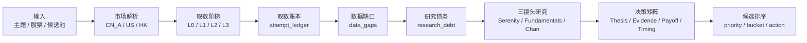
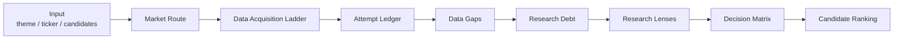

# serenity-chan-stock-skill

Language: [中文](#中文) | [English](#english)

`serenity-chan-stock-skill` is a data-first equity research skill for A-share, US, HK, and cross-market stock research. It turns a theme, ticker, or candidate pool into an auditable research workflow with market-specific source routing, real-data acquisition, research-debt tracking, candidate scoring, and falsification gates.

Scope: research workflow, evidence discipline, rating limits, candidate prioritization, and follow-up tracking. It does not provide personalized investment advice, promise returns, or execute trades.

---

## 中文

### 一句话

把“这条主线/这家公司值不值得继续研究？”转成一份可以复核、可以补数、可以比较优先级的研究结果。

```text
先取真实数据 → 记录取数账本 → 标出研究债务 → 判断产业链瓶颈
→ 验证财务兑现 → 检查估值赔率 → 观察技术位置 → 输出候选优先级
```



### 它解决什么问题

| 常见问题 | 本 skill 的处理 |
|---|---|
| 报告很完整，真实数据没有取到 | 每个数据集都有取数尝试、状态、缺口类型和下一步补数任务 |
| A 股、美股、港股源混用 | 先解析市场，再走市场专属披露源、行情源和禁用源规则 |
| 热点题材直接映射股票 | 先排产业链层级和瓶颈，再排公司候选 |
| 财务数据来自 F10 却给高评级 | L3 结构化预检会生成财报验证债务，研究评级封顶到 B |
| 平均分掩盖关键证据缺口 | 决策矩阵用非线性门控压低优先级和行动状态 |
| 结论无法复盘 | 输出证据等级、研究债务、证伪条件和候选排序 |

### 核心分层

| 层 | 负责什么 | 关键文件 |
|---|---|---|
| 合同层 | 统一市场、数据状态、缺口类型、评级上限、取数记录 | `scripts/data_contracts.py` |
| 取数层 | 供应商适配、原始数据保存、基础校验 | `scripts/data_layer.py` |
| 路由层 | 生成 manifest、attempt ledger、data gaps、research debt、manual tasks | `scripts/data_router.py` |
| 决策层 | Thesis Quality、Evidence Confidence、Market Payoff、Action Readiness | `scripts/serenity_chan_scorecard.py` |
| 排序层 | 多候选相对优先级和同簇判断 | `scripts/candidate_ranker.py` |
| 门禁层 | Markdown/JSON 输出合同、静态 eval、真实数据 smoke | `scripts/validate_output_contract*.py`, `scripts/run_*` |

### 市场路由

| 市场 | 代码例子 | 主披露源 | 内置能力 | 禁止替代 |
|---|---|---|---|---|
| A 股 | `688019.SH`, `300750.SZ`, `920593.BJ` | CNINFO、SSE、SZSE、BSE、公司 IR | Yahoo L2 行情/历史、CNINFO 公告元数据、Eastmoney F10 L3 财务预检 | 用 SEC 替代 A 股公告；把 F10 当官方原文 |
| 美股 | `NVDA`, `MU`, `AMD` | SEC EDGAR、Company IR | Yahoo query1/query2 L2 行情/历史、SEC submissions/companyfacts/companyconcepts、CIK bootstrap | 用 A 股 F10 或摘要替代 SEC |
| 港股 | `0700.HK`, `9988.HK` | HKEXnews、公司公告 | Yahoo L2 行情/历史 | 直接套用 ADR、A/H 价格、股本或货币 |

### 数据获取合同

正式研究必须区分“请求了但失败”“本轮未请求”“源不适用”“发行人未披露”“L3 可机读预检”。这些状态会进入 manifest：

| 字段 | 含义 |
|---|---|
| `data_acquisition.attempt_ledger` | 每个数据集的逐源尝试记录，包含 source level、stage、status、reason |
| `data_acquisition.data_gaps` | 机器可读的数据缺口，包含 gap type、decision impact、rating impact、next action |
| `data_acquisition.research_debt` | 影响评级或行动的待补证据 |
| `data_acquisition.manual_retrieval_tasks` | 自动取数无法完成时的人工/agent 补数任务 |
| `data_quality` | 当前请求和完整研究的评级上限 |
| `ai_review` | 需要 AI 判断的源强度、行业口径、warning 和升级条件 |
| `assets/sec_cik_bootstrap.json` | SEC ticker 目录不可用时的稳定 CIK 启动表 |

关键缺口类型：

`ACCESS_FAILURE`, `SCOPE_NOT_REQUESTED`, `SOURCE_NOT_IMPLEMENTED`, `SOURCE_UNAVAILABLE`, `ISSUER_NON_DISCLOSURE`, `NOT_MACHINE_READABLE`, `CONFLICTING_SOURCES`, `STALE_DATA`, `NOT_MATERIAL`, `POLICY_BLOCKED`

### 决策评分

评分服务于“先研究谁、能不能行动、还差什么证据”。高主题分和高赔率不能覆盖关键数据债务。

| 维度 | 输出 |
|---|---|
| Thesis Quality | 产业链层级、公司瓶颈、财务兑现、风险控制 |
| Evidence Confidence | 主源覆盖、财报验证、声明可追溯性、交叉验证、时效 |
| Market Payoff | 估值折价、隐含增长与证据匹配、上下行赔率 |
| Action Readiness | 当前价、复权历史、技术结构、数据债务、风险控制 |
| Candidate Priority | 候选优先级分数和 watchlist bucket |

行动状态：

`CORE_CANDIDATE`, `STRONG_OBSERVE`, `CANDIDATE_POOL`, `WAIT_FOR_BUY_POINT`, `DATA_GATED`, `LEAD_TRACKING`, `ELIMINATE`, `OBSERVE_ONLY`

### 快速开始

解析代码和数据源计划：

```bash
python scripts/data_router.py resolve 688019
python scripts/data_router.py plan NVDA
```

真实取数并生成可审计数据包：

```bash
python scripts/data_router.py fetch 300480 \
  --out-dir /tmp/serenity-chan-data/300480

python scripts/data_router.py fetch NVDA \
  --out-dir /tmp/serenity-chan-data/NVDA \
  --sec-user-agent "Your Name your.email@example.com"
```

计算单个候选：

```bash
python scripts/serenity_chan_scorecard.py assets/scorecard_template.json --format both
```

对多个候选排序：

```bash
python scripts/candidate_ranker.py candidate_a.json candidate_b.json candidate_c.json
```

交付前门禁：

```bash
python scripts/validate_output_contract.py <report.md>
python scripts/validate_output_contract_json.py <contract.json>
python scripts/run_static_evals.py
```

真实数据 smoke：

```bash
python scripts/run_real_data_smoke.py --case-set a-share \
  --out-root /tmp/serenity-chan-real-data-smoke
```

### 本地验证

```bash
python scripts/validate_skill.py .
python scripts/serenity_chan_scorecard.py assets/scorecard_template.json --validate-only
python scripts/validate_output_contract_json.py evals/fixtures/pass_output_contract_json.json
python scripts/run_static_evals.py
```

### 安装

Codex / Agent Skills-compatible clients:

```bash
SKILL_DIR="${CODEX_HOME:-$HOME/.codex}/skills/serenity-chan-stock-skill"
mkdir -p "$SKILL_DIR"
cp -R SKILL.md references assets scripts examples evals agents "$SKILL_DIR"/
```

Claude Code:

```bash
SKILL_DIR="$HOME/.claude/skills/serenity-chan-stock-skill"
mkdir -p "$SKILL_DIR"
cp -R SKILL.md references assets scripts examples evals agents "$SKILL_DIR"/
```

---

## English

### What It Is

`serenity-chan-stock-skill` is a data-first equity research skill for A-share, US, HK, and cross-market workflows. It helps an agent move from a theme, ticker, or candidate pool to a verifiable research output with market routing, data acquisition records, research debt, decision scoring, candidate ranking, and falsification triggers.

### Core Workflow

```text
Resolve market → fetch real data → record attempts → classify gaps
→ create research debt → analyze bottlenecks → score decision readiness
→ rank candidates → deliver guarded output
```



### Design Principles

| Principle | Meaning |
|---|---|
| No Data, No Guess | Missing critical data must create explicit limits and tasks |
| Market-Specific Routing | A-share, US, and HK sources are isolated by market |
| Evidence Before Rating | L0/L1 evidence controls high-conviction ratings |
| Debt Before Action | Critical research debt blocks core-candidate action states |
| Ranking Over Average | Candidate priority reflects usefulness, not a neutral average |

### Key Outputs

| Output | Purpose |
|---|---|
| `manifest.json` | Full data bundle summary |
| `attempt_ledger.json` | Source-by-source acquisition record |
| `data_gaps.json` | Typed data gaps and decision impact |
| `research_debt.json` | Evidence debt that limits rating or action |
| `manual_retrieval_tasks.json` | Concrete retrieval tasks for unresolved gaps |
| Scorecard result | Research rating, evidence confidence, action readiness, candidate priority |

### Key Commands

```bash
python scripts/data_router.py fetch NVDA --sec-user-agent "Your Name your.email@example.com"
python scripts/serenity_chan_scorecard.py assets/scorecard_template.json --format both
python scripts/candidate_ranker.py candidate_a.json candidate_b.json
python scripts/validate_output_contract_json.py <contract.json>
python scripts/run_static_evals.py
```

### Key Files

| Path | Purpose |
|---|---|
| `scripts/data_contracts.py` | Shared enums and structured data contracts |
| `scripts/data_layer.py` | Providers, raw artifact persistence, basic validation |
| `scripts/data_router.py` | Fetch manifest, attempt ledger, gaps, debt, tasks |
| `scripts/serenity_chan_scorecard.py` | Decision scorecard and nonlinear gates |
| `scripts/candidate_ranker.py` | Relative candidate ranking |
| `assets/data_acquisition_policy.json` | Source ladder and dataset materiality |
| `assets/sec_cik_bootstrap.json` | SEC CIK bootstrap for high-frequency US test tickers |
| `assets/output_contract.schema.json` | Structured delivery contract |
| `evals/static_cases.json` | Regression cases |
