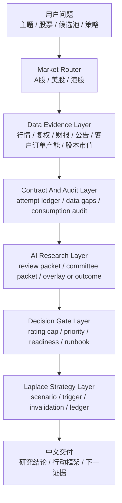
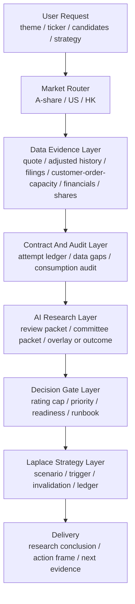

# serenity-chan-stock-skill

Language: [中文](#中文) | [English](#english)

`serenity-chan-stock-skill` is an evidence-first equity research operating system for A-share, US, HK, and cross-market workflows. It turns a theme, ticker, or candidate pool into auditable data packages, validated AI research, decision gates, candidate priority, action triggers, and a bundled `laplace-forecast` strategy layer.

Scope: research workflow, evidence discipline, rating limits, candidate prioritization, and follow-up tracking. It does not provide personalized investment advice, promise returns, or execute trades.

---

## 中文

### 一句话

把“这条主线/这家公司值不值得继续研究、现在该怎么跟踪？”转成一份可以取数、复核、比较、门控、行动和复盘的研究系统。

### 一眼看懂

| 你输入 | 系统做什么 | 你得到什么 |
|---|---|---|
| 一个主题 | 先建价值链层级和候选宇宙，再逐个取真实数据 | 哪些层级值得研究，哪些热门方向需要降级 |
| 一只股票 | 解析市场、抓行情/财报/公告/股本、市值和复权历史 | 数据质量、证据强度、评级上限、证伪条件 |
| 一组候选 | 对比产业链卡点、财务、估值、技术、资本动作和 AI overlay | 研究优先级、行动门控、补证 runbook |
| 一个策略问题 | 读取 Serenity 报告并进入 `laplace-forecast` companion | 情景推演、30/90/180 天触发器、失效条件和复盘 claim |

### 顶层设计



### 可信边界

| 原则 | 含义 |
|---|---|
| No Data, No Guess | 当前价、市值、财报、公告、客户、订单和买点都必须先走真实取数或明确降级 |
| Market-Specific Routing | A 股走 CNINFO/交易所，美股走 SEC/IR，港股走 HKEXnews，跨市场显式处理货币和股本口径 |
| Evidence Before Rating | L0/L1 证据、数据消费审计和 AI overlay 决定评级上限，高分不能覆盖关键债务 |
| AI With Contracts | AI 研究必须输出可校验的 `ai_research_overlay` 或 `ai_review_outcome` |
| Strategy After Research | 策略判断基于 `laplace_strategy_input`，把研究债务转成触发器、失效条件和下一证据 |

### 它解决什么问题

| 常见问题 | 本 skill 的处理 |
|---|---|
| 报告很完整，真实数据没有取到 | 每个数据集都有取数尝试、状态、缺口类型和下一步补数任务 |
| A 股、美股、港股源混用 | 先解析市场，再走市场专属披露源、行情源和禁用源规则 |
| 股本、市值、PE/PS 需要决策约束 | `valuation_inputs` 默认取当前价格、总股本、总市值、货币、日期和来源口径；候选对比用 `valuation_input_matrix` 暴露估值输入，缺估值输入进入 `VALUATION_GATED` 且 `primary_gate_class=DATA_ACQUISITION`，估值证据不足进入 `VALUATION_GATED` 且 `primary_gate_class=RESEARCH_VALIDATION` |
| 数据取到了但下游没用上 | `data_consumption_audit` 检查 financials / valuation_inputs 是否被财务、增长和排序矩阵正确消费；错配时 `ranking_validity=INVALID` |
| 港股/跨市场币种不一致 | `currency_normalization_matrix` 把市值口径归一到财报口径；FX 失败时保留估值门控，不输出市场隐含增长 |
| 财报金额单位和市值金额单位不同 | 财务矩阵显式记录 `financial_statement_unit` 与 `financial_unit_multiplier`；PE/PS 只使用绝对金额计算 |
| 客户、订单、产能证据只停留在印象 | `customer_order_capacity_evidence` 从官方公告/filing 中抽取 direct evidence、lead evidence 和 review queue；候选对比用 `customer_evidence_matrix` 暴露证据状态和下一证据 |
| 热点题材直接映射股票 | 先排产业链层级和瓶颈，再排公司候选 |
| 主题扫描靠手工挑票 | `build_theme_candidate_universe.py` 基于行业 domain pack 先生成价值链层级、候选宇宙、热门降级方向和 AI 扩展任务 |
| 财务数据来源强度不够 | A 股优先抽取 CNINFO L0 官方报告 PDF 核心财务行，覆盖中文与英文版合并报表；仅 F10 预检会生成财报验证债务并封顶到 B |
| 平均分掩盖关键证据缺口 | 决策矩阵用非线性门控压低优先级，并区分数据获取、研究验证和行动时机 |
| AI 判断只停留在文字感受 | `ai_research_overlay` 必须带来源、置信度、反证和待验证问题，校验通过后才能影响对比报告 |
| AI 研究没有真正执行 | `build_ai_overlay_prompt.py` 生成可执行研究包；成功输出 overlay，证据不足或冲突输出 `ai_review_outcome`，两者都必须校验后合并 |
| 资本动作只写“有风险” | `capital_action_quantification` 把定增、H 股上市、减持、回购等拆成新增股份、发行价、锁定期、募资用途、减持比例等字段级任务 |
| 缺口太多不知道先补什么 | `research_debt_runbook` 把研究债务转成轴线、阻塞等级、首选来源、验证目标和补齐后的决策影响 |
| 候选池看起来能排但本质不同 | `candidate_pool_semantic_coherence` 区分同层候选、同主题不同层、跨主题诊断和无关诊断，限制正式决策对象 |
| 结论无法复盘 | 输出证据等级、研究债务、证伪条件和候选排序 |
| 研究结果还需要变成策略 | `laplace_strategy_input` 将 Serenity 报告交给内置 `laplace-forecast` companion，继续生成情景、触发器、失效条件和 ledger claim |

### 核心分层

| 层 | 负责什么 | 关键文件 |
|---|---|---|
| 合同层 | 统一市场、数据状态、缺口类型、评级上限、取数记录 | `scripts/data_contracts.py` |
| 取数层 | 供应商适配、原始数据保存、基础校验 | `scripts/data_layer.py` |
| 路由层 | 生成 manifest、attempt ledger、data gaps、research debt、manual tasks | `scripts/data_router.py` |
| 特征层 | 技术健康、A 股资本动作、资本动作量化、财务质量、财报金额单位归一、估值输入矩阵、预检级 PE/PS 和增长假设矩阵 | `scripts/technical_health.py`, `scripts/a_share_capital_actions.py`, `scripts/a_share_capital_action_quantifier.py`, `scripts/financial_amounts.py` |
| AI 研究层 | 生成 AI 审阅包、AI 研究委员会包、AI overlay prompt、agent workspace、校验 overlay/outcome、合并到候选对比 | `scripts/build_ai_review_packet.py`, `scripts/build_ai_committee_packet.py`, `scripts/build_ai_overlay_prompt.py`, `scripts/build_agent_overlay_workspace.py`, `scripts/validate_ai_overlay.py`, `scripts/validate_ai_review_outcome.py`, `scripts/validate_and_merge_ai_overlay.py` |
| 主题层 | 行业 domain pack、价值链层级、候选宇宙、热门降级方向和 AI 扩展任务 | `references/17_industry_domain_packs.md`, `scripts/build_theme_candidate_universe.py`, `scripts/validate_theme_candidate_universe.py` |
| 决策层 | Thesis Quality、Evidence Confidence、Market Payoff、Action Readiness | `scripts/serenity_chan_scorecard.py` |
| 对比层 | 多候选研究债务、层级、AI 状态、财务、增长、技术、资本动作量化、候选池一致性和优先级 | `scripts/build_comparison_report.py` |
| 门禁层 | 标准输出合同、候选对比合同、静态 eval、真实数据 smoke | `scripts/validate_output_contract*.py`, `scripts/validate_comparison_report.py`, `scripts/run_*` |
| 策略层 | 从候选对比进入预测、情景、触发器、行动计划和复盘账本 | `scripts/build_laplace_strategy_input.py`, `scripts/build_laplace_strategy_prompt.py`, `scripts/validate_laplace_strategy_input.py`, `scripts/validate_laplace_strategy_judgment.py`, `scripts/render_strategy_report.py`, `companion-skills/laplace-forecast/` |

### 市场路由

| 市场 | 代码例子 | 主披露源 | 内置能力 | 禁止替代 |
|---|---|---|---|---|
| A 股 | `688019.SH`, `300750.SZ`, `920593.BJ` | CNINFO、SSE、SZSE、BSE、公司 IR | Eastmoney + Tencent L2 行情/前复权 K 线、Tencent 股本/市值估值输入、CNINFO 权益分派复权构造、Yahoo L2 辅助交叉行情、CNINFO 公告元数据、CNINFO L0 官方报告 PDF 核心财务行抽取（中文/英文合并报表）、银行/证券/保险专门 profile、Eastmoney F10 L3 结构化财务预检 | 用 SEC 替代 A 股公告；把 F10 当官方原文；把金融企业当普通经营企业 |
| 美股 | `NVDA`, `MU`, `AMD`, `TSM`, `ASML` | SEC EDGAR、Company IR | Yahoo query1/query2 L2 行情/历史、SEC submissions、SEC companyfacts/companyconcepts 的 US-GAAP / IFRS XBRL 财务事实、CIK bootstrap | 用 A 股 F10 或摘要替代 SEC |
| 港股 | `0700.HK`, `9988.HK` | HKEXnews、公司公告 | Yahoo L2 行情/历史、HKEXnews 公告元数据、HKEX 年报/中报/月报/翌日披露报表股本抽取 + Yahoo HK 行情估值输入、官方年报/中报 PDF 下载与核心财务行抽取 | 直接套用 ADR、A/H 价格、股本或货币 |

### 数据获取合同

正式研究必须区分“请求了但失败”“本轮未请求”“源不适用”“发行人未披露”“L3 可机读预检”。这些状态会进入 manifest：

| 字段 | 含义 |
|---|---|
| `data_acquisition.attempt_ledger` | 每个数据集的逐源尝试记录，包含 source level、stage、status、reason |
| `data_acquisition.data_gaps` | 机器可读的数据缺口，包含 gap type、decision impact、rating impact、next action |
| `data_acquisition.research_debt` | 影响评级或行动的待补证据 |
| `data_acquisition.manual_retrieval_tasks` | 自动取数无法完成时的人工/agent 补数任务 |
| `valuation_inputs` | 当前价格、总股本、总市值、货币、日期和来源口径；流通股和流通市值在源可得时记录 |
| `valuation_input_matrix` | 候选对比中的估值输入审计表，逐候选暴露价格、股本、市值、来源、口径、验证需求和 warning |
| `currency_normalization_matrix` | 候选对比中的币种归一表，逐候选暴露原始市值币种、财报币种、FX 汇率、归一后市值和失败原因 |
| `financial_statement_unit` / `financial_unit_multiplier` | 财务矩阵中的金额单位口径；增长矩阵的 PE/PS 使用绝对收入和绝对净利润 |
| `customer_order_capacity_evidence` | 基于官方公告、filing 或 IR 披露元数据生成客户、订单、产能、招投标证据 lane |
| `customer_evidence_matrix` | 候选对比中的客户/订单/产能证据审计表，暴露 direct/lead/review 数量、证据状态、分数和下一证据 |
| `data_consumption_audit` | 候选对比中的数据消费审计表，确认取到的数据是否被财务、增长和排序矩阵正确消费 |
| `readiness_matrix` | 候选对比中的三层状态表，拆分 Fetch Status、Research Readiness、Action Readiness 和 Data Evidence Cap |
| `data_quality` | 当前请求和完整研究的评级上限 |
| `ai_review` | 需要 AI 判断的源强度、行业口径、warning 和升级条件 |
| `ai_research_overlay` | AI 对产业层级、卡点、收入传导、反证和下一步问题的结构化判断 |
| `ai_review_status_matrix` | 每个候选的 AI 研究执行状态；正式研究使用 `COMPLETED`、`FAILED_INSUFFICIENT_EVIDENCE` 或 `CONFLICT_WITH_DATA`，诊断基线才允许 `NOT_RUN`，显式快速审计才允许 `SKIPPED_QUICK_AUDIT` |
| `ai_review_outcome` | AI 已尝试但证据不足、与确定性数据冲突或用户要求快速审计时的结构化结果 |
| `candidate_pool_semantic_coherence` | 候选池语义一致性；只有同层候选且行动门控解除后，才能产生正式决策对象 |
| `capital_action_quantification` | 资本动作量化矩阵，暴露缺失字段、稀释/回购/减持影响和下一步核验任务 |
| `research_debt_runbook` | 可执行补证清单，按轴线、阻塞等级、首选来源和验证目标组织 |
| `laplace_strategy_input` | 由候选对比报告派生的策略预测输入，内置 companion skill 路径、决策上下文、候选事实、主导变量、策略问题和 ledger seed |
| `assets/sec_cik_bootstrap.json` | SEC ticker 目录不可用时的稳定 CIK 启动表 |

关键缺口类型：

`ACCESS_FAILURE`, `SCOPE_NOT_REQUESTED`, `SOURCE_NOT_IMPLEMENTED`, `SOURCE_UNAVAILABLE`, `ISSUER_NON_DISCLOSURE`, `NOT_MACHINE_READABLE`, `CONFLICTING_SOURCES`, `STALE_DATA`, `EVIDENCE_DEPTH_LIMIT`, `ADJUSTMENT_BASIS_UNVERIFIED`, `NOT_MATERIAL`, `POLICY_BLOCKED`

### 决策评分

评分服务于“先研究谁、能不能行动、还差什么证据”。高主题分和高赔率不能覆盖关键数据债务。

| 维度 | 输出 |
|---|---|
| Thesis Quality | 产业链层级、公司瓶颈、财务兑现、风险控制 |
| Evidence Confidence | 主源覆盖、财报验证、声明可追溯性、交叉验证、时效 |
| Market Payoff | 估值折价、隐含增长与证据匹配、上下行赔率 |
| Action Readiness | 当前价、复权历史、技术结构、数据债务、风险控制 |
| Candidate Priority | 候选优先级分数和 watchlist bucket |

行动状态：

`CORE_CANDIDATE`, `STRONG_OBSERVE`, `CANDIDATE_POOL`, `WAIT_FOR_BUY_POINT`, `DATA_GATED`, `RESEARCH_GATED`, `LEAD_TRACKING`, `ELIMINATE`, `OBSERVE_ONLY`

候选对比会把正式评级上限、研究优先级、行动优先级和行动门控拆开呈现。行动门控同时输出 `primary_gate` 与 `primary_gate_class`：缺数据使用 `DATA_ACQUISITION`，财报/公告已取得但证据等级或复核不足使用 `EVIDENCE_VALIDATION`，产业链、估值增长和资本动作判断待验证使用 `RESEARCH_VALIDATION`，买点等待使用 `ACTION_TIMING`。同样是 `rating_cap=B` 时，财务质量、资本动作、技术健康、产业链层级和补证任务仍会形成不同的优先级。最终结论还会输出 `decision_mode`、`ranking_validity`、与第二名分差和候选池数量提示，避免候选差距很小时过度确定。

`ranking_validity` 决定排序能否作为正式结论。`VALID` 可以输出正式候选排序，`PARTIAL` 只能作为研究优先级，`INVALID` 只输出工程诊断和补数/修复任务；报告标题会显示“工程诊断排序｜非投资候选排序”，并将 `decision_grade=false`。
`MISMATCH` 会使 `ranking_validity=INVALID`；`PARTIAL` / `DATA_GATED` 数据消费或 high/critical `research_debt` 会使 `ranking_validity=PARTIAL`。

AI 研究阶段提交两类正式结果：证据足够时生成 `ai_research_overlay`，证据不足、冲突或快速审计时生成 `ai_review_outcome`。overlay 提交产业链映射、证据支持增长、反证和下一步问题；outcome 记录失败原因、冲突字段和需要补齐的证据。`market_implied_growth` 始终由 `valuation_input_matrix`、PE/PS 和同币种财务口径生成。
`candidate_pool_semantic_coherence` 会把候选池标记为同层候选、同主题不同层、跨主题诊断或无关诊断；只有同层候选且行动门控解除后，才能产生正式决策对象，其余状态只能作为研究优先级或诊断集合。
用户可读分析默认使用中文描述；机器字段可以保留英文枚举，但必须用中文解释含义和限制。

### 快速开始

正式候选研究入口：

```bash
python scripts/run_research_analysis.py 688019 688322 \
  --out-dir /tmp/serenity-chan-run/688019-688322 \
  --research-mode formal
```

这个命令会完成真实取数、生成内部数据基线，并为每个候选生成 `ai_review_packet.json`、`ai_committee_packet.json` 和 `ai_overlay_prompt.json`。缺少 AI overlay/outcome 时，formal 模式输出 `AGENT_RESEARCH_QUEUE_READY` 并写出 `agent_research_queue.json`。当前 AI 执行全部 `work_items` 后，继续传入 `--overlay SYMBOL=overlay.json` 或 `--ai-outcome SYMBOL=outcome.json`，脚本会执行证据校验、合并并生成 `comparison_final.json` / `comparison_final.md`。

只做数据质量排查时使用诊断模式：

```bash
python scripts/run_research_analysis.py 688019 688322 \
  --out-dir /tmp/serenity-chan-run/688019-688322-diagnostic \
  --research-mode diagnostic
```

诊断模式输出只能用于数据状态、缺口和研究任务分派，不能作为正式候选排序或行动建议。

主题扫描先生成候选宇宙：

```bash
python scripts/build_theme_candidate_universe.py 机器人 \
  --out /tmp/serenity-chan-data/robotics_universe.json

python scripts/validate_theme_candidate_universe.py /tmp/serenity-chan-data/robotics_universe.json

python scripts/build_theme_research_packet.py /tmp/serenity-chan-data/robotics_universe.json \
  --out /tmp/serenity-chan-data/robotics_theme_research_packet.json

python scripts/validate_theme_research_packet.py /tmp/serenity-chan-data/robotics_theme_research_packet.json
```

AI 基于 `references/17_industry_domain_packs.md` 扩展候选到足够覆盖的产业链层级，方向级研究包负责宏观驱动、产业卡点、反证和扩展任务，再把候选代码交给正式研究入口。
非内置主题由 AI 按 `assets/theme_candidate_universe.schema.json` 先写出候选宇宙并通过 `validate_theme_candidate_universe.py`，不得用占位候选替代真实候选。

主题正式研究入口：

```bash
python scripts/run_theme_research_analysis.py 机器人 \
  --out-dir /tmp/serenity-chan-run/robotics-theme \
  --research-mode formal
```

解析代码和数据源计划：

```bash
python scripts/data_router.py resolve 688019
python scripts/data_router.py plan NVDA
```

真实取数并生成可审计数据包：

```bash
python scripts/data_router.py fetch 300480 \
  --out-dir /tmp/serenity-chan-data/300480

python scripts/data_router.py fetch NVDA \
  --out-dir /tmp/serenity-chan-data/NVDA \
  --sec-user-agent "Your Name your.email@example.com"
```

计算单个候选：

```bash
python scripts/serenity_chan_scorecard.py assets/scorecard_template.json --format both
```

对多个候选排序：

```bash
python scripts/candidate_ranker.py candidate_a.json candidate_b.json candidate_c.json
```

从真实取数 manifest 生成确定性 baseline：

```bash
python scripts/build_comparison_report.py \
  /tmp/serenity-chan-data/688019/manifest.json \
  /tmp/serenity-chan-data/688322/manifest.json \
  --format json > /tmp/serenity-chan-data/comparison_report.json

python scripts/validate_comparison_report.py /tmp/serenity-chan-data/comparison_report.json
```

执行 AI 研究并合并正式结果：

```bash
python scripts/build_ai_overlay_prompt.py /tmp/serenity-chan-data/688019/manifest.json \
  --theme-universe /tmp/serenity-chan-data/robotics_universe.json \
  --theme-research-packet /tmp/serenity-chan-data/robotics_theme_research_packet.json \
  --out /tmp/serenity-chan-data/688019/ai_overlay_prompt.json

python scripts/build_ai_review_packet.py /tmp/serenity-chan-data/688019/manifest.json \
  --out /tmp/serenity-chan-data/688019/ai_review_packet.json

python scripts/build_ai_committee_packet.py /tmp/serenity-chan-data/688019/manifest.json \
  --out /tmp/serenity-chan-data/688019/ai_committee_packet.json
```

formal 工作流生成 `agent_research_queue.json` 后，可先构建逐候选 AI 工作台，集中暴露 review packet、committee packet、source_ref catalog、客户/订单/产能证据和确定性矩阵：

```bash
python scripts/validate_agent_research_queue.py /tmp/serenity-chan-data/agent_research_queue.json
python scripts/build_agent_overlay_workspace.py /tmp/serenity-chan-data/agent_research_queue.json \
  --out /tmp/serenity-chan-data/agent_overlay_workspace.json
```

AI 读取 prompt、review packet、committee packet 和源文件后产出一个正式结果：证据足够时写 `ai_overlay.json`，证据不足、数据冲突或用户要求快速审计时写 `ai_review_outcome.json`。AI committee 的 `consensus`、`dissent`、`upgrade_conditions`、`downgrade_conditions` 是研究记录；最终 `ai_overlay.json` 只写 `assets/ai_research_overlay.schema.json` 允许字段。可用 `committee_to_overlay.py` 将已有 AI 委员会输出收敛为严格 overlay；脚本只做字段映射和校验，不凭空生成研究判断。

```bash
python scripts/committee_to_overlay.py /tmp/serenity-chan-data/688019/ai_committee_output.json \
  --out /tmp/serenity-chan-data/688019/ai_overlay.json

python scripts/validate_ai_overlay.py /tmp/serenity-chan-data/688019/ai_overlay.json \
  --manifest /tmp/serenity-chan-data/688019/manifest.json
python scripts/validate_ai_review_outcome.py /tmp/serenity-chan-data/688322/ai_review_outcome.json

python scripts/validate_and_merge_ai_overlay.py \
  /tmp/serenity-chan-data/688019/manifest.json \
  /tmp/serenity-chan-data/688322/manifest.json \
  --overlay 688019.SH=/tmp/serenity-chan-data/688019/ai_overlay.json \
  --ai-outcome 688322.SH=/tmp/serenity-chan-data/688322/ai_review_outcome.json \
  --report-out /tmp/serenity-chan-data/comparison_final.json \
  --markdown-out /tmp/serenity-chan-data/comparison_final.md \
  --format json

python scripts/validate_research_delivery.py /tmp/serenity-chan-data/comparison_final.json

python scripts/render_research_report.py \
  --comparison-report /tmp/serenity-chan-data/comparison_final.json \
  --mode full_research
```

正式合并时，overlay 的 `source_ref` 会解析到对应 manifest 的真实 source artifact 或 AI review packet；无法解析的引用、与证据不一致的数字 claim 会阻断合并。
可参考 `examples/comparison_688019_688322/` 中的 AI overlay benchmark。

进入 Laplace 策略层：

```bash
python scripts/build_laplace_strategy_input.py /tmp/serenity-chan-data/comparison_final.json \
  --theme "A股机器人与AI算力" \
  --horizon "3-6个月" \
  --decision-use "watchlist allocation, action triggers, and invalidation" \
  --out /tmp/serenity-chan-data/laplace_strategy_input.json

python scripts/validate_laplace_strategy_input.py /tmp/serenity-chan-data/laplace_strategy_input.json

python scripts/build_laplace_strategy_prompt.py /tmp/serenity-chan-data/laplace_strategy_input.json \
  --out /tmp/serenity-chan-data/laplace_strategy_prompt.json

python scripts/validate_laplace_strategy_judgment.py /tmp/serenity-chan-data/laplace_strategy_judgment.json \
  --strategy-input /tmp/serenity-chan-data/laplace_strategy_input.json

python scripts/render_strategy_report.py /tmp/serenity-chan-data/laplace_strategy_judgment.json \
  --strategy-input /tmp/serenity-chan-data/laplace_strategy_input.json \
  --out /tmp/serenity-chan-data/strategy_report.md
```

`build_laplace_strategy_input.py` 只接受 `report_readiness.stage=FINAL_REPORT_READY` 的 `comparison_final.json`；内部基线、agent queue、`NOT_RUN` 或快速诊断输出不会进入策略层。AI 读取 `references/16_laplace_strategy_bridge.md` 与 `companion-skills/laplace-forecast/SKILL.md` 后，按 `assets/laplace_strategy_judgment.schema.json` 输出中文策略 judgment，再由 validator 和 renderer 生成正式策略报告。重要主题或中期策略判断同步生成可写入 forecast ledger 的 claim。

交付前门禁：

```bash
# 标准单股 / 主题 / 数据审计输出
python scripts/validate_output_contract.py <report.md>
python scripts/validate_output_contract_json.py <contract.json>
python scripts/validate_research_delivery.py <comparison_final.json>

# 候选对比输出
python scripts/validate_comparison_report.py <comparison_report.json>
python scripts/validate_research_delivery.py <comparison_final.json>
python scripts/render_research_report.py --comparison-report <comparison_final.json> --mode full_research
python scripts/build_laplace_strategy_prompt.py <laplace_strategy_input.json> --out <laplace_strategy_prompt.json>
python scripts/validate_laplace_strategy_judgment.py <laplace_strategy_judgment.json> --strategy-input <laplace_strategy_input.json>
python scripts/render_strategy_report.py <laplace_strategy_judgment.json> --strategy-input <laplace_strategy_input.json>

python scripts/run_static_evals.py
```

真实数据 smoke：

```bash
python scripts/run_real_data_smoke.py --case-set a-share \
  --out-root /tmp/serenity-chan-real-data-smoke
```

### 本地验证

```bash
python scripts/validate_skill.py .
python scripts/serenity_chan_scorecard.py assets/scorecard_template.json --validate-only
python scripts/validate_output_contract_json.py evals/fixtures/pass_output_contract_json.json
python scripts/build_comparison_report.py evals/fixtures/comparison_688019_manifest.json evals/fixtures/comparison_688322_manifest.json --format json > /tmp/serenity-comparison-report.json
python scripts/validate_comparison_report.py /tmp/serenity-comparison-report.json
python scripts/build_theme_candidate_universe.py 机器人 --out /tmp/serenity-theme-universe.json
python scripts/validate_theme_candidate_universe.py /tmp/serenity-theme-universe.json
python scripts/build_theme_research_packet.py /tmp/serenity-theme-universe.json --out /tmp/serenity-theme-research-packet.json
python scripts/validate_theme_research_packet.py /tmp/serenity-theme-research-packet.json
python scripts/run_static_evals.py
```

### 安装

Codex / Agent Skills clients:

```bash
SKILL_DIR="${CODEX_HOME:-$HOME/.codex}/skills/serenity-chan-stock-skill"
mkdir -p "$SKILL_DIR"
cp -R SKILL.md references assets scripts examples evals agents companion-skills "$SKILL_DIR"/
```

Claude Code:

```bash
SKILL_DIR="$HOME/.claude/skills/serenity-chan-stock-skill"
mkdir -p "$SKILL_DIR"
cp -R SKILL.md references assets scripts examples evals agents companion-skills "$SKILL_DIR"/
```

---

## English

### What It Is

`serenity-chan-stock-skill` is an evidence-first equity research operating system for A-share, US, HK, and cross-market workflows. It moves from a theme, ticker, candidate pool, or strategy question to auditable data, validated AI research, decision gates, scenario strategy, and follow-up evidence.

### At A Glance

| Input | What The System Does | Output |
|---|---|---|
| Theme | Builds value-chain layers and a candidate universe before fetching tickers | Layer map, candidate pool, downgraded hot directions |
| Ticker | Resolves market and fetches quote, adjusted history, filings, financials, shares, and valuation inputs | Data quality, evidence strength, rating cap, falsification |
| Candidate set | Compares bottlenecks, financials, valuation, technical state, capital actions, and AI overlays | Research priority, action gates, runbook |
| Strategy question | Converts the Serenity report into `laplace_strategy_input` | Scenarios, triggers, invalidation, ledger claims |

### Top-Level Design



### Design Principles

| Principle | Meaning |
|---|---|
| No Data, No Guess, Exhaust Retrieval First | Critical data is routed through market-specific acquisition ladders before rating limits or action gates are set |
| Market-Specific Routing | A-share, US, and HK sources are isolated by market |
| Evidence Before Rating | L0/L1 evidence controls high-conviction ratings |
| Debt Before Action | Critical research debt blocks core-candidate action states |
| AI With Evidence | AI overlays need source references, confidence, contrary evidence, and research questions |
| AI Execution Closure | AI research must end with a validated overlay or a validated review outcome |
| Capital Actions Are Quantified | Dilution, buyback, listing, reduction, lockup, and use-of-proceeds fields become explicit tasks |
| Research Debt Becomes Runbooks | Open debt is converted into sources, validation targets, and expected decision impact |
| Research Becomes Strategy | Validated comparison reports generate `laplace_strategy_input` for the bundled `laplace-forecast` companion |
| Theme Before Ticker | Theme scans start from value-chain layers and a candidate universe before fetching individual tickers |
| Deterministic Market-Implied Growth | Market-implied growth is derived from complete valuation inputs and computable PE/PS |
| Ranking Over Average | Candidate priority reflects usefulness, not a neutral average |
| Decision Clarity | Final decisions separate research lead, action lead, formal decision object, candidate cluster, and non-decision-grade states |
| Ranking Validity | Mismatched data consumption invalidates ranking; partial or data-gated consumption and high/critical research debt keep ranking partial |

### Key Outputs

| Output | Purpose |
|---|---|
| `manifest.json` | Full data bundle summary |
| `attempt_ledger.json` | Source-by-source acquisition record |
| `data_gaps.json` | Typed data gaps and decision impact |
| `research_debt.json` | Evidence debt that limits rating or action |
| `manual_retrieval_tasks.json` | Concrete retrieval tasks for unresolved gaps |
| `valuation_inputs.json` | Current price, total shares, total market cap, currency, as-of date, share-count basis, market-cap basis; float shares and float market cap when available |
| `valuation_input_matrix` | Comparison-level audit table for price, shares, market cap, source, basis, verification need, and warnings |
| `data_consumption_audit` | Downstream-consumption audit for fetched financial and valuation data |
| AI review packet / overlay / outcome | Structured bridge between deterministic data and domain research judgment |
| `customer_order_capacity_evidence` | Disclosure-derived customer, order, bid-win, and capacity evidence lane |
| `customer_evidence_matrix` | Candidate-level audit matrix for direct evidence, disclosure leads, review queue, score, and next evidence |
| `ai_review_status_matrix` | Per-candidate AI execution state: completed, insufficient evidence, data conflict, quick audit, or not run |
| `candidate_pool_semantic_coherence` | Semantic coherence of the candidate pool and its decision constraint |
| `capital_action_quantification` | Field-level capital-action impact and missing quantitative inputs |
| `research_debt_runbook` | Executable source and validation plan for open research debt |
| `laplace_strategy_input` | Structured handoff from Serenity research to Laplace scenarios, triggers, invalidation, action planning, and ledger claims |
| Official report PDFs | Downloaded CNINFO/HKEX report artifacts with `pdf_hash`; A-share Chinese/English consolidated reports and HK reports include extracted core financial lines when PDF text is readable; A-share financial-sector reports include bank, securities, or insurance profiles when required fields are extracted |
| Scorecard result | Research rating, evidence confidence, action readiness, candidate priority |
| Comparison report | Candidate-level acquisition, layer, financial, valuation-input, growth, technical, capital-action, debt, and priority matrices |

### Key Commands

```bash
python scripts/run_research_analysis.py 688019 688322 --out-dir /tmp/serenity-chan-run/688019-688322 --research-mode formal
python scripts/run_research_analysis.py 688019 688322 --out-dir /tmp/serenity-chan-run/688019-688322 --research-mode formal --strategy-theme "A-share robotics" --strategy-horizon "3-6 months"
python scripts/data_router.py fetch NVDA --sec-user-agent "Your Name your.email@example.com"
python scripts/serenity_chan_scorecard.py assets/scorecard_template.json --format both
python scripts/candidate_ranker.py candidate_a.json candidate_b.json

# Candidate-comparison contract
python scripts/build_comparison_report.py manifest_a.json manifest_b.json --format json > comparison_report.json
python scripts/validate_comparison_report.py comparison_report.json

python scripts/build_ai_overlay_prompt.py manifest_a.json --theme-universe theme_candidate_universe.json --theme-research-packet theme_research_packet.json --out ai_overlay_prompt.json
python scripts/build_ai_review_packet.py manifest_a.json --out ai_review_packet.json
python scripts/build_ai_committee_packet.py manifest_a.json --out ai_committee_packet.json
python scripts/validate_ai_overlay.py ai_overlay.json --manifest manifest_a.json
python scripts/validate_ai_review_outcome.py ai_review_outcome.json
python scripts/validate_agent_research_queue.py agent_research_queue.json
python scripts/build_agent_overlay_workspace.py agent_research_queue.json --out agent_overlay_workspace.json
python scripts/validate_and_merge_ai_overlay.py manifest_a.json manifest_b.json --overlay TICKER_A=ai_overlay.json --ai-outcome TICKER_B=ai_review_outcome.json --report-out comparison_final.json --markdown-out comparison_final.md
python scripts/validate_research_delivery.py comparison_final.json
python scripts/render_research_report.py --comparison-report comparison_final.json --mode full_research
python scripts/build_laplace_strategy_input.py comparison_final.json --theme "A-share AI infrastructure" --out laplace_strategy_input.json
python scripts/validate_laplace_strategy_input.py laplace_strategy_input.json
python scripts/build_laplace_strategy_prompt.py laplace_strategy_input.json --out laplace_strategy_prompt.json
python scripts/validate_laplace_strategy_judgment.py laplace_strategy_judgment.json --strategy-input laplace_strategy_input.json
python scripts/render_strategy_report.py laplace_strategy_judgment.json --strategy-input laplace_strategy_input.json --out strategy_report.md
python scripts/build_theme_candidate_universe.py "AI compute" --out ai_compute_universe.json
python scripts/validate_theme_candidate_universe.py ai_compute_universe.json
python scripts/build_theme_research_packet.py ai_compute_universe.json --out ai_compute_theme_research_packet.json
python scripts/validate_theme_research_packet.py ai_compute_theme_research_packet.json

# Standard single-company/theme output contract
python scripts/validate_output_contract.py <report.md>
python scripts/validate_output_contract_json.py <output_contract.json>

python scripts/run_static_evals.py
python scripts/run_real_data_smoke.py --case-set all --out-root /tmp/serenity-chan-real-data-smoke
```

### Key Files

| Path | Purpose |
|---|---|
| `scripts/data_contracts.py` | Shared enums and structured data contracts |
| `scripts/data_layer.py` | Providers, raw artifact persistence, basic validation |
| `scripts/data_router.py` | Fetch manifest, attempt ledger, gaps, debt, tasks |
| `scripts/run_research_analysis.py` | Top-level workflow: fetch, internal baseline, agent research queue, validated merge, final report |
| `scripts/build_theme_candidate_universe.py` | Layer-first candidate universe builder for common themes |
| `scripts/validate_theme_candidate_universe.py` | Candidate-universe contract validator |
| `scripts/build_theme_research_packet.py` | Direction-level AI research packet builder |
| `scripts/validate_theme_research_packet.py` | Direction-level AI research packet validator |
| `scripts/run_theme_research_analysis.py` | Theme workflow orchestrator: universe, direction packet, real fetch, agent research queue |
| `scripts/technical_health.py` | Technical-health matrix from adjusted daily history |
| `scripts/a_share_capital_actions.py` | A-share capital-action detection from announcement metadata |
| `scripts/a_share_capital_action_quantifier.py` | Field-level capital-action quantification |
| `scripts/build_comparison_report.py` | Candidate comparison report from fetch manifests |
| `scripts/build_ai_review_packet.py` | AI review packet builder from fetch manifest |
| `scripts/build_ai_committee_packet.py` | Multi-role AI research committee packet builder |
| `scripts/build_ai_overlay_prompt.py` | Executable prompt package for AI overlay generation |
| `scripts/build_agent_overlay_workspace.py` | Structured workspace for executing formal agent research queue items |
| `scripts/data_consumption.py` | Audit whether fetched datasets are consumed by downstream matrices |
| `scripts/build_research_debt_runbook.py` | Converts open debt into an executable runbook |
| `scripts/financial_periods.py` | Cross-market fiscal-period normalization |
| `scripts/render_research_report.py` | Full Markdown research-report renderer |
| `scripts/build_laplace_strategy_input.py` | Strategy handoff builder for the bundled Laplace companion |
| `scripts/build_laplace_strategy_prompt.py` | Strategy judgment prompt package builder |
| `scripts/validate_laplace_strategy_input.py` | Strategy handoff contract validator |
| `scripts/validate_laplace_strategy_judgment.py` | Strategy judgment validator |
| `scripts/render_strategy_report.py` | Chinese strategy-report renderer |
| `scripts/validate_comparison_report.py` | Candidate-comparison contract validator |
| `scripts/validate_ai_overlay.py` | AI research overlay validator |
| `scripts/validate_ai_review_outcome.py` | AI review failure/skip outcome validator |
| `scripts/validate_agent_research_queue.py` | Formal agent research queue validator |
| `scripts/validate_research_delivery.py` | Formal delivery validator |
| `scripts/validate_and_merge_ai_overlay.py` | Validated overlay/outcome merge and report builder |
| `scripts/merge_ai_research_overlay.py` | Validated merge CLI with overlay/outcome checks |
| `scripts/serenity_chan_scorecard.py` | Decision scorecard and nonlinear gates |
| `scripts/candidate_ranker.py` | Relative candidate ranking for scorecard payloads |
| `assets/comparison_output_contract.schema.json` | Structured comparison-report contract |
| `assets/laplace_strategy_input.schema.json` | Serenity-to-Laplace strategy input contract |
| `assets/laplace_strategy_judgment.schema.json` | AI strategy judgment output contract |
| `assets/customer_order_capacity_evidence.schema.json` | Customer/order/capacity evidence lane contract |
| `assets/theme_candidate_universe.schema.json` | Theme candidate universe and value-chain layer contract |
| `assets/valuation_inputs.schema.json` | Valuation-input data contract |
| `assets/ai_research_overlay.schema.json` | AI research overlay contract |
| `assets/ai_review_outcome.schema.json` | AI review failure/skip outcome contract |
| `assets/agent_research_queue.schema.json` | Formal agent research queue contract |
| `assets/research_workflow_state.schema.json` | Workflow state contract |
| `assets/capital_action_quantification.schema.json` | Capital-action quantification contract |
| `assets/data_acquisition_policy.json` | Source ladder and dataset materiality |
| `assets/sec_cik_bootstrap.json` | SEC CIK bootstrap for high-frequency US test tickers |
| `assets/output_contract.schema.json` | Structured delivery contract |
| `references/17_industry_domain_packs.md` | Robotics, AI compute, innovative medicine, and grid/power domain packs |
| `evals/static_cases.json` | Regression cases |
| `companion-skills/laplace-forecast/` | Bundled companion skill for forecasting, scenarios, action triggers, invalidation, and forecast ledgering |
