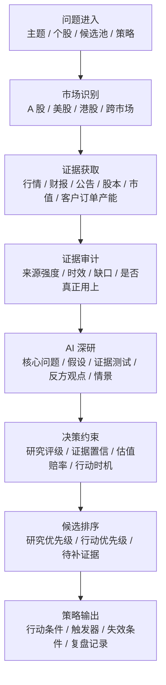
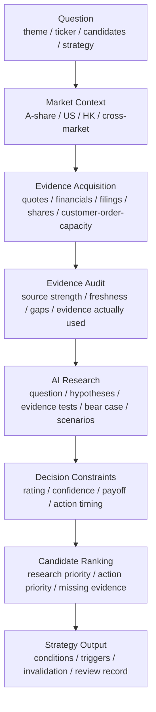

# serenity-chan-stock-skill

Language: [中文](#中文) | [English](#english)

serenity-chan-stock-skill 是一个证据驱动的股票研究助手，面向 A 股、美股、港股和跨市场候选比较。它把一个主题、一只股票、一组候选或一个策略问题，组织成可以追踪、复核、比较和行动的研究流程。

它的定位是研究辅助、证据整理、候选比较、行动条件和复盘。投资决策由使用者自行负责。

---

## 中文

### 一句话

serenity-chan 把“这家公司、这条主线、这组候选是否值得继续研究”拆成真实数据、产业位置、AI 深研、评分约束、行动条件和复盘线索。

### 它适合处理什么

| 输入 | 它会关注什么 | 你会得到什么 |
|---|---|---|
| 一个产业主题 | 产业链层级、真正的瓶颈、候选公司覆盖度、热门叙事的证据强度 | 值得优先研究的层级、候选池和需要降温的方向 |
| 一只股票 | 市场归属、当前价格、财务质量、公告证据、客户订单产能、估值和买点 | 数据质量、研究评级边界、关键待补证据和下一步核验 |
| 一组候选 | 是否同层可比、谁更接近瓶颈、谁证据更强、谁更接近行动 | 研究优先级、行动优先级、观察名单和候选池边界 |
| 一个策略问题 | 大趋势、情景概率、触发条件、失效条件、仓位和复盘 | 可执行方向、30/90/180 天触发器和后续观察路径 |

### 研究流程

这条流程的重点是把 AI 的研究能力引到更深处：先让 AI 提出问题和假设，再让 AI 检验证据、拆分反方观点和情景，最后把研究判断投影成可执行结论。

### 研究原则

| 原则 | 含义 |
|---|---|
| 证据先行 | 当前价、股本、市值、财报、公告、客户、订单、产能和买点都进入证据链 |
| 市场分流 | A 股、美股、港股各自使用对应市场的披露和行情语境 |
| 缺口可见 | 每个关键缺口都会留下状态、影响、下一证据和评级约束 |
| AI 深研 | AI 负责提出假设、拆证据、识别反证、构建情景和行动条件 |
| 关键约束 | 关键待补证据会压住评级和行动状态，防止平均分掩盖核心风险 |
| 同层比较 | 候选排序优先比较同一产业层级和同一决策语境 |
| 策略闭环 | 研究结论继续转化为触发器、失效条件和复盘判断记录 |

### AI 如何参与研究

AI 在 serenity-chan 里承担完整研究工作：提出问题、构建假设、检验证据、形成行动条件。它会形成一份 AI 深研档案，内容包括：

| 研究面 | AI 要回答的问题 |
|---|---|
| 核心问题 | 这只股票或这个候选池真正需要判断的关键点是什么 |
| 假设组 | 哪些假设支持主线，哪些假设会削弱主线 |
| 证据测试 | 每个关键假设需要哪些证据，目前证据到了什么程度 |
| 事实边界 | 哪些是已经观察到的事实，哪些是推断，哪些是最终判断 |
| 因果链 | 需求如何传导到订单、收入、利润、现金流和股东回报 |
| 同层比较 | 候选之间是否处于同一产业层级，差异来自哪里 |
| 反方观点 | 哪些事实会压低结论，哪些风险会改变行动状态 |
| 情景判断 | 基准、上行、下行分别怎样发生，概率和触发条件是什么 |
| 行动条件 | 什么情况下升级、加仓、继续观察、减仓或退出 |

这套设计让 AI 保留充分的研究空间，同时把结论锁定在可复核的证据链上。

### 评分如何工作

serenity-chan 的评分目标是识别“更值得研究”和“更接近行动”的候选。它把研究结论拆成五个面向：

| 维度 | 关注点 |
|---|---|
| 主线质量 | 产业位置、公司卡点、增长质量、竞争壁垒、风险约束 |
| 证据置信 | 主源强度、财报可追溯性、公告证据、交叉验证和时效 |
| 估值赔率 | 当前估值、隐含增长、赔率、预期差和下行情景 |
| 行动成熟度 | 当前价格、技术结构、买点、待补数据和风险控制 |
| 策略节奏 | 触发器、等待条件、失效条件、复盘周期和仓位节奏 |

高主题热度会提高研究价值；高估值、关键证据待补、弱现金流、客户订单缺失、资本动作压力和买点未成熟会压低行动状态。

### 候选比较逻辑

候选比较会先判断“比较基础是否成立”，再判断“谁更值得研究”，最后判断“谁更接近行动”。

| 阶段 | 关键判断 |
|---|---|
| 候选池识别 | 候选是否属于同一主题、同一产业层级或同一决策问题 |
| 产业层级比较 | 谁更接近真正的瓶颈，谁的主题映射成分更重 |
| 财务兑现比较 | 收入、利润、现金流、毛利率和资本开支是否支持主线 |
| 估值赔率比较 | 市场已经定价到什么程度，隐含增长是否领先证据 |
| 待补证据比较 | 谁缺客户、订单、产能、财报、股本、市值或买点证据 |
| 行动状态比较 | 谁适合行动，谁适合观察，谁更适合继续补证 |

### 最终输出长什么样

一份理想输出会让读者快速回答这些问题：

| 问题 | 输出 |
|---|---|
| 现在最值得研究谁 | 研究优先级和理由 |
| 当前是否具备行动条件 | 行动状态、主要约束和等待条件 |
| 结论的支撑和限制是什么 | 关键证据、来源强度和待补证据 |
| 最大反证是什么 | 会压低结论的事实、风险和触发条件 |
| 下一步看什么 | 需要补的公告、财报、客户、订单、产能、价格或技术条件 |
| 多久复盘一次 | 30/90/180 天触发器和复盘判断记录 |

### 使用方式

在 Codex 中提出自然语言请求即可，例如：

| 你可以这样问 | serenity-chan 会做什么 |
|---|---|
| 分析 688019 和 688322 | 做真实数据底稿、AI 深研、候选比较和行动约束 |
| 分析机器人行业的 A 股 | 先拆产业链层级，再构建候选池并筛出优先方向 |
| 现在有什么可操作方向 | 把研究结论转成情景、触发器、行动条件和失效条件 |
| 为什么这个候选评级被压住 | 回到待补证据、数据缺口、估值和买点约束 |
| 给我几个候选再跑一轮 | 扩展候选池，比较同层候选和跨层候选 |

### 读者应该如何理解结果

| 结果类型 | 含义 |
|---|---|
| 强观察 | 研究价值高，等待关键证据或买点 |
| 候选池 | 进入持续跟踪，仍需补齐证据 |
| 研究待验证 | 核心假设需要进一步验证 |
| 数据待补齐 | 当前数据链路或关键字段影响结论强度 |
| 行动待条件 | 研究逻辑成立，价格、技术或风险条件仍需等待 |
| 淘汰 | 核心假设被削弱，继续投入研究的性价比下降 |

### 设计气质

serenity-chan 追求的是“让 AI 像强研究员一样工作”：

| 能力 | 表现 |
|---|---|
| 会找证据 | 主动走真实数据链路，保留取数状态和来源强度 |
| 会拆问题 | 先定义核心问题，再拆假设、证据测试和反方观点 |
| 会降温 | 对热门叙事加入估值、财务、客户、订单和现金流约束 |
| 会比较 | 候选之间先校准层级，再判断优先级 |
| 会行动 | 输出升级、加仓、观察、减仓、退出的条件 |
| 会复盘 | 把判断变成可回看的触发器和复盘记录 |

---

## English

### What It Does

serenity-chan-stock-skill is an evidence-driven equity research assistant for A-share, US, HK, and cross-market workflows. It turns a theme, ticker, candidate pool, or strategy question into real-data research, AI investigation, decision constraints, action conditions, and reviewable follow-up.

It supports research assistance, evidence organization, candidate comparison, action framing, and forecast review. Users remain responsible for investment decisions.

### At A Glance

| Input | Focus | Output |
|---|---|---|
| Theme | Value-chain layers, bottlenecks, candidate coverage, narrative strength | Priority layers, candidate pool, cooled-down directions |
| Ticker | Market, price, financials, filings, customer/order/capacity, valuation, timing | Data quality, evidence strength, rating boundary, next evidence |
| Candidate Set | Comparable layer, bottleneck fit, evidence quality, action readiness | Research priority, action priority, constraints, tracked list |
| Strategy Question | Trend, scenarios, triggers, invalidation, sizing rhythm | Action direction, 30/90/180 day triggers, review path |

### Research Flow

The flow channels AI into deeper research: define the question, form hypotheses, test evidence, explore the bear case, build scenarios, then convert the judgment into executable conditions.

### Principles

| Principle | Meaning |
|---|---|
| Evidence First | Price, shares, market cap, financials, filings, customers, orders, capacity, and timing enter the evidence chain |
| Market-Aware Routing | A-share, US, and HK research use their own disclosure and market context |
| Visible Gaps | Each key gap carries status, impact, next evidence, and rating constraint |
| AI Research Depth | AI frames hypotheses, tests evidence, detects counterevidence, builds scenarios, and writes action conditions |
| Critical Constraints | Missing critical evidence constrains rating and action state |
| Same-Layer Comparison | Candidate ranking starts from comparable value-chain layers and decision context |
| Strategy Loop | Research conclusions become triggers, invalidation conditions, and reviewable judgment records |

### How AI Participates

AI creates a research record before producing a final judgment. The record captures:

| Surface | Question |
|---|---|
| Core Question | What is the real decision problem for this stock or candidate set |
| Hypotheses | Which assumptions support the thesis, and which assumptions reduce it |
| Evidence Tests | What evidence each assumption needs, and how strong the current evidence is |
| Fact Boundary | What is observed, what is inferred, and what is judged |
| Causal Chain | How demand moves into orders, revenue, profit, cash flow, and shareholder return |
| Same-Layer Comparison | Whether candidates share the same layer and where the differences come from |
| Bear Case | Which facts reduce conviction or action readiness |
| Scenarios | How base, upside, and downside cases unfold |
| Action Conditions | When to upgrade, add, observe, trim, or exit |

This gives AI room to reason deeply while keeping conclusions tied to reviewable evidence.

### Scoring Model

The score identifies candidates worth deeper research and candidates closest to action.

| Dimension | Focus |
|---|---|
| Thesis Quality | Value-chain role, company bottleneck, growth quality, moat, risk limits |
| Evidence Confidence | Primary-source strength, financial traceability, filing support, cross-checking, freshness |
| Market Payoff | Valuation, implied growth, upside/downside, expectation gap |
| Action Readiness | Price, technical setup, action timing, missing evidence, risk control |
| Strategy Timing | Triggers, waiting conditions, invalidation, review cycle, sizing rhythm |

Theme heat can raise research priority. Expensive valuation, weak evidence, poor cash flow, missing customer/order data, capital-action pressure, and immature timing reduce action readiness.

### Candidate Comparison

Candidate comparison follows a sequence:

| Stage | Judgment |
|---|---|
| Candidate Pool | Are these names part of the same theme, layer, or decision question |
| Value-Chain Layer | Which name sits closer to the true bottleneck |
| Financial Realization | Do revenue, profit, cash flow, margins, and capex support the thesis |
| Market Payoff | How much growth the market already prices in |
| Missing Evidence | Which name lacks customer, order, capacity, financial, share, market-cap, or timing evidence |
| Action State | Which name is actionable, observable, needs more research, or eliminated |

### Expected Output

The result should answer:

| Question | Output |
|---|---|
| Who deserves research first | Priority ranking and reasons |
| Is action appropriate now | Action state, main constraint, waiting condition |
| What supports or limits the view | Key evidence, source strength, missing evidence |
| What can break the view | Bear facts, risks, and invalidation triggers |
| What to check next | Filings, financials, customers, orders, capacity, price, or technical setup |
| When to revisit | 30/90/180 day triggers and reviewable judgment records |

### How To Use

Ask naturally in Codex:

| Request | What serenity-chan Does |
|---|---|
| Analyze 688019 and 688322 | Builds a real-data base, AI research record, comparison, and action constraints |
| Analyze A-share robotics | Maps value-chain layers, builds candidates, and ranks research priorities |
| Give me an actionable direction | Converts research into scenarios, triggers, action conditions, and invalidation |
| Why is this candidate constrained | Explains missing evidence, data gaps, valuation, and timing constraints |
| Run another candidate set | Expands and compares same-layer and cross-layer candidates |

### Reading The Result

| Result Type | Meaning |
|---|---|
| Strong Observe | High research value with pending evidence or timing |
| Candidate Pool | Worth tracking with remaining evidence gaps |
| Research Pending | Core thesis requires further validation |
| Data Pending | Data chain or critical fields constrain conclusion strength |
| Action Pending | Thesis quality is present, while price, timing, or risk still waits |
| Eliminate | The thesis weakened enough to reduce research priority |

### Design Character

serenity-chan is designed to make AI behave like a strong research analyst:

| Capability | Behavior |
|---|---|
| Finds Evidence | Routes through real data and records source strength |
| Frames Problems | Defines the core question before scoring |
| Tests Hypotheses | Separates support, counterevidence, and missing proof |
| Cools Narratives | Adds valuation, financial, customer, order, and cash-flow constraints |
| Compares Carefully | Aligns layers before ranking candidates |
| Drives Action | Produces upgrade, add, observe, trim, and exit conditions |
| Reviews Itself | Converts judgments into triggers and reviewable records |
